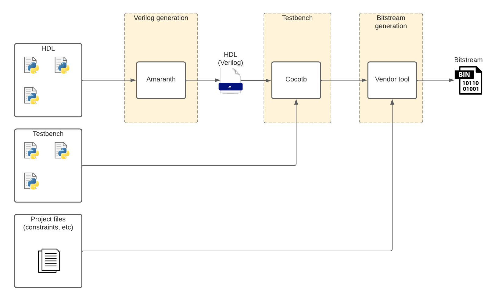

[](https://github.com/akukulanski/hdl-utils/actions/workflows/ci.yml)

# HDL-Utils

Utils for an HDL workflow with Amaranth as HDL framework and Cocotb as testing framework.

**Note:** This is not more than an unified place where I can add utils that I use in multiple places.

Amaranth Utils:
* `hdl_utils.amaranth_utils.generate_verilog`: generate verilog from Amaranth cores.
* `hdl_utils.amaranth_utils.interfaces`: DataStream interfaces.

Cocotb Utils:
* `hdl_utils.cocotb_utils.testcases`: classes `TemplateTestbenchVerilog` and `TemplateTestbenchAmaranth` to create pytest testcases that run testbenches.
* `hdl_utils.cocotb_utils.tb`: class `BaseTestbench` with clk and reset.
* `hdl_utils.cocotb_utils.tb_utils`: misc useful functions.
* `hdl_utils.cocotb_utils.buses`: Stream and AXI Stream buses for testbenches.

## Install

```bash
uv venv
uv pip install git+https://github.com/akukulanski/hdl-utils.git

# Check
uv run python3 -c "import hdl_utils; print(f'{hdl_utils.__file__}')"
```

## Run tests

```bash
# Clone repo
git clone https://github.com/akukulanski/hdl-utils.git
cd hdl-utils

# Sync dependencies
uv sync

# Run tests
uv run python3 -m pytest -vs src/hdl_utils/test/test_amaranth_utils.py --log-cli-level info
```

## Examples

Files:
```console
$ tree example/
example/
├── counter.py
├── counter.v
├── data_stream_inverter.py
├── data_stream_pass_through.py
├── stream_signature.py
├── tb
│   ├── tb_counter.py
│   ├── tb_data_stream_inverter.py
│   ├── tb_data_stream_pass_through.py
│   ├── tb_stream_signature.py
│   └── tb_uart_rx.py
├── test_cores.py
└── uart_rx.v

2 directories, 12 files
```

Generate Verilog from Counter in Amaranth:
```bash
uv run python3 example/counter.py 8 > counter.v
cat counter.v
```

Generate Verilog from stream inverter with signatures in Amaranth:
```bash
uv run python3 example/stream_signature.py > inverter.v
cat inverter.v
```

Run all example testbenches with:
```bash
uv run python3 -m pytest -o log_cli=True -vs example/test_cores.py
```

## Workflow


